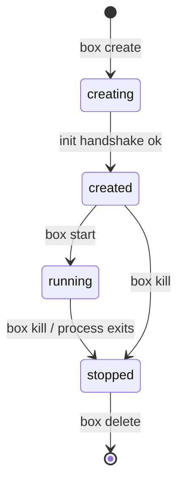

# `boxes`

Building a minimal Linux container runtime in Go

<div class="pt-8 opacity-80">
  create → start → kill → delete, from scratch
</div>

<div class="abs-br m-6 text-sm opacity-60">
  Michael Duren · <a href="https://github.com/michael-duren/boxes" target="_blank">github.com/michael-duren/boxes</a>
</div>

<!--
Presenter notes: Welcome. Today we're going to take the magic out of containers
by building one. Not a toy that prints "hello" — a real OCI-style lifecycle runtime.
-->

---

layout: two-cols
class: pt-4

---

# whoami

- Developer, Linux tinkerer
- Wanted to understand what `docker run` _actually_ does
- So I built `box` — a small runtime in the spirit of `runc` and `youki`

**Status:** early, learning-oriented. APIs unstable on purpose.

::right::

<div class="pl-6 pt-12">

```text
┌──────────────┐
│   docker     │
├──────────────┤
│  containerd  │
├──────────────┤
│    runc      │ ◄── this layer
├──────────────┤
│ Linux kernel │
└──────────────┘
```

`box` lives where `runc` lives:
the thing that actually talks to the kernel.

</div>

<!--
The whole stack above runc is orchestration. The interesting, "what is a container"
part is this bottom layer. That's what we're rebuilding.
-->

---

# A container is not a thing

There is no `container` syscall.

A "container" is just a normal Linux process with three things wrapped around it:

<v-clicks>

- **Namespaces** — what the process can _see_ (PIDs, mounts, network, hostname…)
- **cgroups** — what the process can _use_ (CPU, memory, pids, IO)
- **A root filesystem** — what `/` _is_ for that process

</v-clicks>

<div v-click class="pt-6 opacity-80">

That's it. Isolation is a lie we tell a perfectly ordinary process.

</div>

<!--
Key reframe for the audience. Once you see it this way, building a runtime stops
being scary — you're just assembling kernel primitives in the right order.
-->

---

# The OCI Runtime contract

`box` doesn't invent an interface — it implements the **OCI Runtime CLI**, the same
contract `runc` exposes. That's what lets tooling drive any compliant runtime.

| Command           | What it does                                          |
| ----------------- | ----------------------------------------------------- |
| `box create <id>` | Build container from a _bundle_ — does **not** run it |
| `box start <id>`  | Start the user process inside it                      |
| `box state <id>`  | Print OCI state JSON                                  |
| `box kill <id>`   | Send a signal to the init process                     |
| `box delete <id>` | Remove a stopped container + its state                |

<div class="pt-4 text-sm opacity-70">

A _bundle_ = a directory with a `config.json` (the OCI runtime spec) and a `rootfs/`.

</div>

---

# Architecture

```text
┌──────────────┐      ┌──────────────────────┐      ┌─────────────────┐
│  box (CLI)   │ ───► │  internal/operations │ ───► │  Linux kernel   │
│  cmd/cli     │      │  lifecycle handlers  │      │  ns / cgroups   │
└──────────────┘      └──────────────────────┘      └─────────────────┘
```

<div class="grid grid-cols-3 gap-4 pt-6 text-sm">
<div>

**`cmd/cli/`**
Cobra entrypoint, subcommand wiring

</div>
<div>

**`internal/operations/`**
One handler per lifecycle verb

</div>
<div>

**`internal/container/`**
State machine, persistence, the init handshake

</div>
</div>

<div class="pt-6 opacity-70 text-sm">
Built on <code>opencontainers/runtime-spec</code> for the state &amp; config types.
</div>

---

# The lifecycle is a state machine



The states come straight from the OCI spec (`specs.StateCreating`, `…Created`,
`…Running`, `…Stopped`). Every command is a guarded transition.

<!--
Emphasize: illegal transitions are rejected. You can't start a stopped container,
can't kill a creating one, etc. The spec defines these and we enforce them.
-->

---

# `create`: the re-exec trick

To put a process in new namespaces, you have to fork a _new_ process — you can't
re-namespace yourself cleanly. The classic move: **re-exec your own binary**.

```go {all|3|6|9-10}
func (c *Container) Init() (err error) {
    // re-run *this* binary, but as the hidden `reexec` subcommand
    cmd := exec.Command("/proc/self/exe", "reexec", c.State.ID)

    // ... wire up namespaces + the init socket on cmd ...

    if err := cmd.Start(); err != nil {
        return err
    }
    c.State.Pid = cmd.Process.Pid          // the container's init PID
    return c.waitForReady()                // block until the child says "ready"
}
```

<div v-click class="pt-2 text-sm opacity-70">
<code>/proc/self/exe</code> is a kernel-provided symlink to the running binary — so the
child is guaranteed to be the same <code>box</code>.
</div>

<!--
This is the single most "aha" slide. runc does the same thing (its `init` is a
re-exec). Explain why you can't just unshare in-process for PID namespaces.
-->

---

# `create`: the init socket handshake

Parent and the re-exec'd child rendezvous over a **unix socket** so the parent
knows the container is set up before reporting `created`.

```go {all|2|4-6|8}
// parent side, after starting the child:
conn, _ := listener.Accept()              // wait for child to dial in

msg, _ := readMessage(conn)
if msg != "ready" {                       // child finished namespace setup
    return fmt.Errorf("unexpected init message: %q", msg)
}

c.State.Status = specs.StateCreated       // only now are we "created"
```

<div class="grid grid-cols-2 gap-4 pt-4 text-sm">
<div v-click>

**Why a handshake?**
`create` must return only once the container is really ready — no races.

</div>
<div v-click>

**Why a socket?**
It crosses the namespace boundary and can pass FDs later (e.g. the console).

</div>
</div>

---

# Namespaces: what the process can see

The re-exec child is started with new namespaces so it gets its own view of the world:

<div class="grid grid-cols-2 gap-x-8 pt-2">
<v-clicks>

- **PID** — its own process tree; the init process is PID 1
- **Mount** — its own mount table, for the new `rootfs`
- **UTS** — its own hostname
- **IPC** — isolated SysV IPC / POSIX queues
- **Network** — its own interfaces (lo only, until we add veth)
- **User** — uid/gid mapping → the path to rootless

</v-clicks>
</div>

<div v-click class="pt-6 opacity-70 text-sm">
In Go this is <code>syscall.SysProcAttr{Cloneflags: CLONE_NEWPID | CLONE_NEWNS | …}</code>
on the re-exec <code>cmd</code>.
</div>

---

# `start`: become the user process

Once created, `start` tells the waiting init process to hand the container over to
the _real_ program from `config.json` — via `exec`, so no extra wrapper PID lingers.

```go {all|5-6}
// inside the container's init process, on the "start" signal:
argv := spec.Process.Args        // e.g. ["/bin/sh"]
env  := spec.Process.Env

// replace this process image entirely — PID 1 *becomes* the user program
if err := syscall.Exec(argv[0], argv, env); err != nil {
    return err
}
// unreachable on success
```

<div v-click class="pt-2 text-sm opacity-70">
<code>syscall.Exec</code> is <code>execve(2)</code>: same PID, brand-new program. This is why your
container's app runs as PID 1.
</div>

---

# `kill`: harder than it looks

`box kill` sends a signal — but **did the process actually die?**

```go {all|2-3|5-6}
func (c *Container) Kill(sig unix.Signal) error {
    if !c.canBeKilled() {                  // guard: only running/created
        return fmt.Errorf("cannot kill in state %s", c.State.Status)
    }
    if err := unix.Kill(c.State.Pid, sig); err != nil {
        return err
    }
    // ⚠️ tempting: mark Stopped here. But the process may linger as a zombie.
    c.State.Status = specs.StateStopped
    return c.Save()
}
```

<div v-click class="pt-2 text-sm text-amber-300">
`kill -0` / `Kill(pid, 0)` to probe liveness doesn't handle <b>zombies</b> — a reaped-but-not-waited
process reads as "alive." This is an open issue in the repo (signals epic).
</div>

<!--
Great place to be honest about a real bug/limitation. Ties directly to issues
#15/#16. Audiences love "here's what's still wrong."
-->

---

# `delete`: clean up the evidence

```go {all|2|4-5}
func Delete(id string) error {
    c, _ := container.Load(id)              // read persisted state

    if c.State.Status == specs.StateRunning {
        return errors.New("cannot delete a running container (use kill first)")
    }
    // signal the init process, then remove state + runtime dirs
    return os.RemoveAll(stateDir(id))
}
```

State lives as a JSON file on disk (`specs.State`), so commands in separate
process invocations can find and mutate the same container.

<div class="pt-3 text-sm opacity-70">
Persisted under <code>$XDG_RUNTIME_DIR/boxes/&lt;id&gt;/</code> — survives between CLI calls.
</div>

---

# `state`: the source of truth

Everything is coordinated through one serialized struct — the OCI state:

```json
{
  "ociVersion": "1.0.2",
  "id": "mybox",
  "status": "running",
  "pid": 48213,
  "bundle": "/tmp/mybox",
  "annotations": {}
}
```

Because it's the **OCI** state schema, the same JSON an external conformance
harness expects is exactly what `box state` prints.

---

# Testing a thing that forks, execs & signals

Three layers, because no single layer can cover it all:

<div class="grid grid-cols-3 gap-4 pt-4 text-sm">
<div v-click>

### Unit

`internal/container`
State-machine guards, `New`/`Save`/`Load` against temp dirs. Fast, no side effects.

</div>
<div v-click>

### Acceptance

Drive the **real** `box` binary end-to-end: namespaces, sockets, real processes.
Covers what unit tests _can't_ reach.

</div>
<div v-click>

### OCI conformance

Run the upstream `runtime-tools` validation suite — an _external_ measure of spec
compliance.

</div>
</div>

<div v-click class="pt-6 opacity-70 text-sm">
The boundary unit tests stop at — the init/reexec handshake, <code>syscall.Exec</code>, signal
delivery — is exactly the boundary acceptance tests start at.
</div>

---

layout: center
class: text-center

---

# Roadmap

<div class="text-left inline-block pt-2">

- ⏳ Wire `create` to fork+exec init in new namespaces _(in progress)_
- ⏳ Parse & honor the full OCI `config.json`
- 🔜 cgroups v2 resource limits
- 🔜 Rootless via user namespaces + `newuidmap`
- 🔜 Networking — veth + bridge, then CNI
- 🔜 `exec` into a running container

</div>

<div class="pt-6 opacity-70 text-sm">
Tracked as epics + tasks on the project board.
</div>

---

# What I learned

<v-clicks>

- **Containers are assembly, not invention.** Every piece is a documented kernel feature.
- **The hard parts aren't isolation** — they're lifecycle, races, and "is it _really_ dead?"
- **The spec is your friend.** Implementing the OCI contract means free, upstream tests.
- **Re-exec yourself** is the trick that unlocks namespaced children.
- Reading `runc` / `youki` source is the best documentation there is.

</v-clicks>

---

layout: center
class: text-center

---

# Thanks 📦

`box` — a minimal OCI runtime you can actually read

<div class="pt-4">

[github.com/michael-duren/boxes](https://github.com/michael-duren/boxes)

</div>

<div class="pt-10 opacity-70 text-sm">
Questions? Let's talk about the zombie-process problem.
</div>

<!--
Wrap up. Invite questions, point to the repo, mention it's beginner-readable on purpose.
-->
